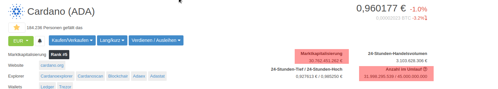

# Wie spekuliere ich mit Crypto Währungen?
## Motivation und Warnung 
Ich möchte hier zusammenschreiben wie und warum ich in Cryptos investiere. Für mich ist Crypto eine alternative zu Aktien oder EFS wo ich mein Geld vor der Inflation rette. 
Generell solltest Du nur Geld investieren welches Du nicht benötigst. Je nach Marktlage kommst Du für eine lange Zeit nicht mehr verlustfrei an Deine Investments. Im Worst Case ist alles weg.
Der Hauptunterschied zu Aktien ist die fehlende Substanz. Hinter jeder Aktie steht ein Unternehmen dessen Tätigkeiten Einfluss auf den Kurs des Papiers nehmen. Bei Crypto Währungen gibt es diese Grundlage nicht. Hier entscheiden nur Nachfrage und Angebot sowie Nachrichten über den Coin, Crypto im Allgemeinen oder das Verhalten von Bitcoin.
Cryptos werden 24h 7 Tage die Woche gehandelt. Auch ist die Volatilität viel höher als bei Wertpapieren.    

## Arten von Crypto Coins
Wie bei Aktien gibt es "solche und solche". Ich gliedere Coins in 3 Gruppen:
- Es gibt etablierte Coins die schon länger am Markt sind und auch außerhalb der Szene bekannt sind. Am bekanntesten sind wohl Bitcoin (BTC) und Ethereum (ETH). 
- Altcoins Projekte mit einer bestimmten Marketcap mit hoher Volatilität die auch gerne mal aufgrund von [Hiobsbotschaften](https://www.sec.gov/news/press-release/2020-338) abstürzen oder einen [Hack](https://www.heise.de/newsticker/meldung/Nach-Trinity-Hack-IOTA-stellt-Migrationstool-fuer-kompromittierte-Seeds-bereit-4672296.html) erleben. Schöne Beispiele dafür sind ADA, PolkaDot, Binance, XRP, XLM, LINK und IOTA
- Shitcoins. Der Name klingt erstmal hart aber darunter fallen neue Projekte mit relativ wenig Substanz die aber ensprechend des Risikos hohe Wachstumsraten bieten können.

## Gewinnmöglichkeiten von Crypto Coins

| Typ                                | Stable Coins                  | Altcoins                  | Shitcoins                                           |
|-----------------------------------|------------------------------|---------------------------|-----------------------------------------------------|
| Wann kaufen                        | Coins die am Boden liegen     | Coins die am Boden liegen | Vor dem Fomo - idealerweise in einem Seitwärtskanal |
| Wann verkaufen / Wie lange halten? | Langfristig  - über 15 Monate | Zeitraum ~ 3 Monate       | Wachstum ab 100%                                    |
| Möglichkeiten über den Zeitraum    | 20%-500%                      | +- 200%                   | ~ +- 1000%                                          |

# Nützliche Links
## Tools
- https://www.coingecko.com/de/portfolio
## Börsen
- [Bitpanda](https://www.bitpanda.com/?ref=930502104161426862)
- [Binance](https://www.binance.com/en/register?ref=41377693)

# Does & Don'ts

## Don'ts 
- Glaub nicht den Youtubern mit den lustigen Gesichtern - die machen gerne [Pump & Dump](https://de.wikipedia.org/wiki/Pump_and_Dump)
- Investiere nicht in einen Coin nur aufgrund einer Quelle
- Fall nicht auf Pump & Dump rein. 
- Behalte die Mathematik im Auge. Kauf nicht nur weil es günstig ist. Schau Dir die [Market Cap](#coin-market-cap) an

## Was man machen sollte
- Hat die Coin ein Supply Limit oder können unendlich viele Einheiten generiert werden? Falls nein solltest Du die Inflation des Coins betrachten
- Du mußt die Grundbegriffe verstehen. 
    - Was ist eine Blockchain?
    - Was sind Altcoins?
    - Was ist der unterschied zwischen Smart Contract und Defi? 
- Fang an zu lesen und schau Dir Videos an
    - Mach Faktenchecks.
    - Erstell eine Liste von Wettbewerbern. (Wettbewerber von ETH sind z.B. Cardano, Cosoms...) 
- Schau dir die Schwächen der Coin an. 
    - Gibt es noch keine Anwendung für den Coin? Wie lange wird es dauern bis das passiert? Wann wird das Team die Ziele des Projekts erreicht haben?
    - Ist das Projekt Liquide? Werden die Entwickler das interesse verlieren wenn der Preis nicht nach oben geht und etwas anderes tun?
- Google "[Name des Coin] scam". 
- Mach einen Hintergrundcheck des Teams. Findest Du die Leute in sozialen Medien? Sind es echte Menschen? 
- Forsche wer bereits in das Projekt investiert hat. Wie sieht die Community hinter dem Projekt aus? Ist das eher ein Kult von Menschen die nur über den Kurs reden? Oder geht es um die Technik und die Möglichekiten? Stehen sie der Zukunft des Projekts optimitsch gegenüber?
- Wenn es ein Whitepaper gibt und viel Wettbewerb: Wird das in dem Dokument erwähnt? Wie wird damit umgegangen?

### Coin Market Cap
Eine interessante Metrik um Cryptos zu vergleichen. Jeder hat mal den Satz "Der Coin kann locker mal 1000$ wert sein" gehört.
Mit Hile der Marktkapitalisierung kann man überprüfen ob das Szenario eintreten kann.

Marktkapitalisierung =  Anzahl der verfügbaren Einheiten *n* * Wert einer Einheit *m*.

###Beispielrechnung für Cardano (ADA) am  2021-03-24

Wir berechnen welchen Preis ADA haben muß um die Market Cap von Bitcoin zu erreichen.

| Coin | Market Cap   | Price    |
|:----:|:------------:|:--------:|
| ADA  | 30762451262  | 47451,38 |
| BTC  | 885595856153 | 0,960177 |

Die Market Cap von BTC ist ~29 mal höher als die von ADA
(885595856153 / 30762451262 )
Ergo muß der Preis von ADA auf 29 * 0,96€ steigen um eine gleiche Marktkapitalisierung zu erreichen. 
Das sind **~27€**  - ein schöner Kurs aber weit entfernt von 1000€ pro Coin.
Um auf die 1000€ / Coin  zu kommen benötigen wir eine Market Cap von *30762451262 / 0,960177 * 1000*
also **32.044.220.064.583,3€**. Die Marktkapitalisierung von Gold beträgt aktuell 11.027 Billionen US$. 
Nun kann man für sich selbst beantworten wie realistisch ein solcher Kurs ist.  
###Nützliche Tools rund um die Market Cap

[Coingecko](https://www.coingecko.com/de/munze/cardano) ist ein ziemlich praktisches Tool und liefert die Werte

[Thecoinperspective.com](https://thecoinperspective.com/?c=ADA&vs=BTC) macht die Berechnung für Dich. 

### Was hier noch fehlt / besser gemacht werden sollte

- kann man beliebig nachdrucken - Doge Coin?  Max Supply
- kommen noch Airdrops - Reef
- Wie lange ist der Coin am Markt? 
- wie mit coingecko arbeiten?
- Börsen und Seiten verlinken
- Quellen verlinken
- Abhängigkeit aller Coins vom BTC klar machen.